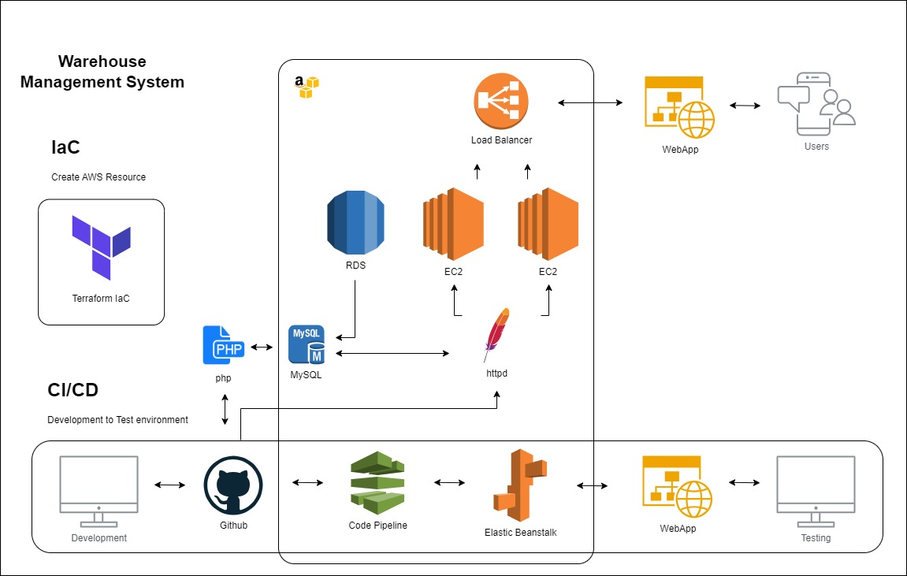

# warehouse_app
Warehouse management application using PHP, AWS RDS (MySQL), EC2 (Ubuntu), and Terraform for infrastructure as code (IaC), This application helps manage inventory, track shipments, and streamline warehouse operations using scalable and reliable AWS services.

# Architecture

## Production

- **PHP Application**: Hosted on an EC2 instance (Ubuntu).
- **Database**: MySQL on AWS RDS.
- **Infrastructure**: Managed with Terraform.

## CI/CD for Developers

- **Elastic Beanstalk**: For deploying and managing the PHP application.
- **CodePipeline**: Automates CI/CD.
- **GitHub**: Hosts the source code repository.

# Prerequisites

- AWS Account
- AWS CLI configured
- Terraform installed
- SSH key pair for EC2
- PHP and Composer installed locally
